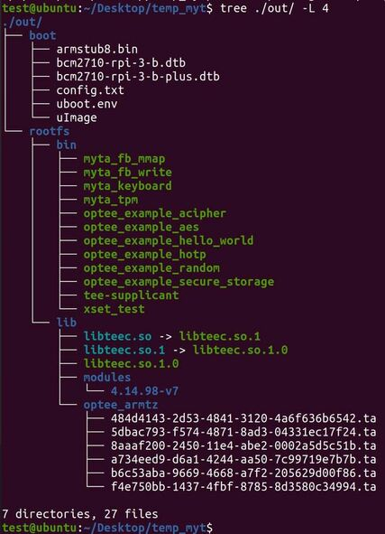

MyTEE
====

MyTEE is a solution that provides a Trusted Execution Environment (TEE) without relying on TrustZone hardware components, such as the TrustZone Address Space Controller (TZASC) and TrustZone Protection Controller (TZPC). It implements the necessary properties for constructing and securing the TEE, including memory protection and secure I/O, by utilizing hardware-assisted virtualization and instrumenting parts of the operating system and trusted firmware. For a detailed design, refer to the paper "MyTEE: Owning the Trusted Execution Environment," published at NDSS 2023.

This repository contains a proof-of-concept (PoC) implementation of MyTEE on a Raspberry development board that lacks TrustZone hardware extensions.

Environment
=====
* Host: Ubuntu 20.04.1
* Development board: Raspberry Pi 3 B+ 
* TPM: Infineon OPTIGA™ TPM SLB 9670
* Rich OS: Linux v4.2.1
* TEE software: OP-TEE v3.4.0

Build and run
=============

* Update packages:

.. code:: bash

  $ sudo apt-get update
* Install packages to build MyTEE::

.. code:: bash

   $ sudo apt install   android-tools-adb   android-tools-fastboot   autoconf   automake   bc   bison   build-essential   ccache   cscope   curl   device-tree-compiler   expect   flex   ftp-upload   gdisk   iasl   libattr1-dev   libcap-dev   libfdt-dev   libftdi-dev   libglib2.0-dev   libgmp3-dev   libhidapi-dev   libmpc-dev   libncurses5-dev   libpixman-1-dev   libssl-dev   libtool   make   mtools   netcat   ninja-build   python3-crypto   python3-cryptography   python3-pip   python3-pyelftools   python3-serial   rsync   unzip   uuid-dev   xdg-utils   xterm   xz-utils   zlib1g-dev  python-is-python3  u-boot-tools

Download MyTEE
--------------------------
* Source Code:

.. code:: bash

  $ git clone https://github.com/sssecret2019/mytee
        
* Toolchains:

.. code:: bash

	$ mkdir toolchains
	$ cd toolchains
	$ wget https://releases.linaro.org/components/toolchain/binaries/7.3-2018.05/aarch64-linux-gnu/gcc-linaro-7.3.1-2018.05-x86_64_aarch64-linux-gnu.tar.xz
	$ wget https://releases.linaro.org/components/toolchain/binaries/7.3-2018.05/arm-linux-gnueabihf/gcc-linaro-7.3.1-2018.05-x86_64_arm-linux-gnueabihf.tar.xz
	$ tar -xvf gcc-linaro-7.3.1-2018.05-x86_64_aarch64-linux-gnu.tar.xz
	$ tar -xvf gcc-linaro-7.3.1-2018.05-x86_64_arm-linux-gnueabihf.tar.xz
	$ cd..
    
* Update the toolchain paths in the script file for building MyTEE:

.. code:: bash

  $ cd ./mytee
  $ vi ./config.mk
    ## Set up two variables, CROSS_COMPILE and CROSS_COMPILE_AARCH64. For example,
    ## export CROSS_COMPILE := /mytee/toolchains/aarch32/bin/arm-linux-gnueabihf-
    ## export CROSS_COMPILE_AARCH64 := /mytee/toolchains/aarch64/bin/aarch64-linux-gnu-
    
  $ vi ./mytee_examples/tpm_orig/Makefile
    ## (Optional) Update Makefile for building the original TPM client application (ELTT2) that is provided by Infenion. For example,
    ## CC = /mytee/toolchains/aarch32/bin/arm-linux-gnueabihf-gcc
    
* Build MyTEE::

.. code:: bash

        $ make        

* Kernel image, OP-TEE, and MyTEE example applications (prefix: myta_) are built. For example,

## For secure IO, the TA needs to execute privileged operations such as creating a mapping to the REE. Hence, the TEE part of a MyTEE example application is built as the PTA for simplicity of implementation.

Flash a SD card
-------------
**The PoC is tested with an official Raspberry Pi OS [2018-11-13-raspbian-stretch]**
 * Raspberry Pi OS download: https://distrowatch.com/?newsid=10376
 * Raspberry Pi Imager helps format a SD card and install the Raspbian image
 * Installing the Raspberry Pi OS is required once for the initial setup

After installing the Raspbian OS, copy the MyTEE images to the SD card:

.. code:: bash

        $ move.sh

Run MyTEE
===========
**Insert the SD card to the board and boot.**

* Successful build generates the components as follows:
.. image:: MyTEE_doc/mytee_driver.JPG

**Secure IO applications are in the mytee_examples directory.**

References
=========
* OP-TEE : https://github.com/OP-TEE/optee_os
* Raspbian with OP-TEE Support : https://github.com/benhaz1024/raspbian-tee
* eltt2 : https://github.com/Infineon/eltt2
