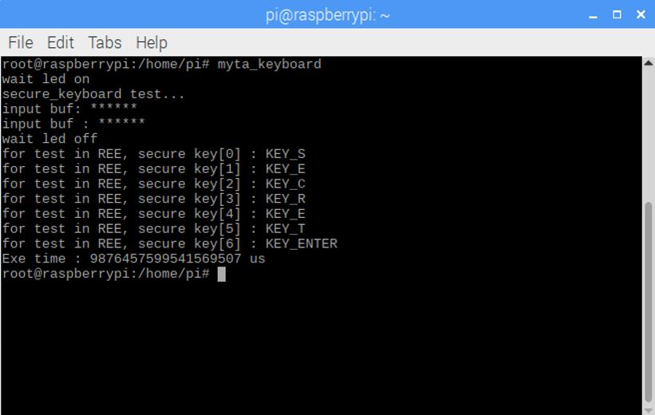
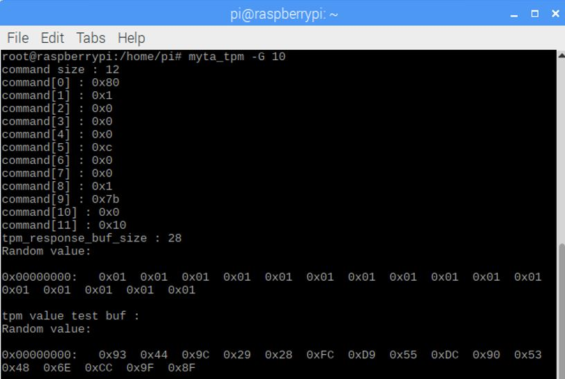
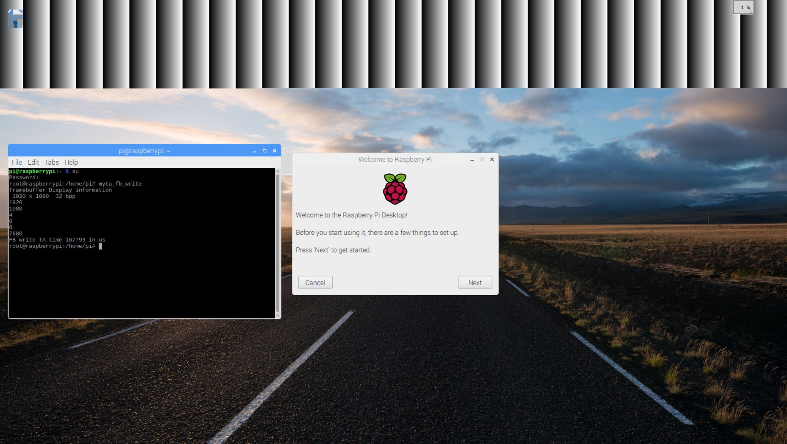

MyTEE secure I/O applications
======================================================

* First, load the TEE library, which is required for running MyTEE applications as well as normal OP-TEE examples.
.. code:: bash

	$ sudo tee-supplicant &
	
* Trusted keyboard

The trusted keyboard aims to conceal key inputs from the REE and allow the TA to process them. 
However, for testing purposes, the key input read by the TA is sent back to the CA and displayed. 

To run it,

.. code:: bash

	$ sudo myta_keyboard
	

* Trusted TPM

Similarly, this TPM example conceals the TPM's output from the REE. 
As depicted in the figure, the TPM output is consistently disguised as 0x01 in the REE. 
Only the TA can read the actual output of TPM, but for debugging purposes, it is currently returned to the CA. 
Note that you need hardware TPM to run this example application.

To run it,

.. code:: bash

	## For example, run the application with [$ sudo myta_tpm -G 10] to generate a random number of 16 bytes.
	## Random number generation and hashing functions were tested.
	$ sudo myta_tpm [command] 
	

* Trusted frame buffer

In this example, the TA-generated random input is written to the framebuffer in a manner that makes it inaccessible to the REE. This can be achieved through two methods: the write-based approach (via "myta_fb_write") writes the TA's input via the modified write system call in the REE OS, while the mmap-based approach (via "myta_fb_mmap") allows the TA to directly access the framebuffer. For debugging purposes, certain information about the framebuffer's settings, such as its display size and resolution, is displayed.

To run them,

.. code:: bash

	$ sudo myta_fb_write
	$ sudo myta_fb_mmap

* Applications without MyTEE

.. code:: bash

	## The TPM application needs root permission.
	$ sudo myta_tpm_no_ta [command]
	
	## Framebuffer applications
	$ myta_fb_write_no_ta
	$ myta_fb_mmap_no_ta
